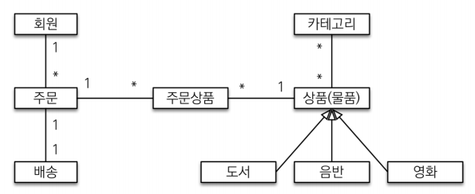
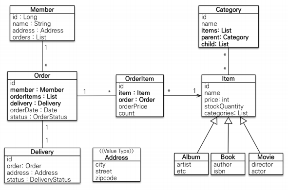

# 🏩 SHOP
## 요구사항 분석 및 모델링

### 동작화면으로부터 확인한 기능
1. 회원 기능
    - 회원 가입
        회원 가입 시, `이름` `도시` `거리` `우편번호` 를 입력받는다.
    - 회원 목록 조회
        목록을 통해 등록된 회원의 정보를 모두 조회할 수 있다.
2. 상품 기능
    - 상품 등록
        상품 등록 시 `상품명` `가격` `수량` `저자` `ISBN`을 입력받는다. 
    - 상품 목록 조회
        목록 조회를 통해 `상품명` `가격` `재고수량` 을 조회할 수 있으며 상품의 세부 내용을 수정할 수 있는 수정 버튼이 있다.
    - 도서 수정
3. 주문 기능
    - 상품 주문하기
        주문하기 기능을 통해 `주문회원` `상품명` `수량`을 입력하여 주문할 수 있다.
    - 주문 내역 확인  
        주문 내역을 확인할 수 있으며, `CANCEL`을 통해 주문을 취소할 수 있다.
    - 주문 내역 검색 기능
        회원명, 주문상태 등으로 검색할 수 있다.

### 구체적인 요구사항
#### 기능 목록
* 회원 기능
    * 회원 등록
    * 회원 조회
* 상품 기능 - 상품에는 도서, 음반, 영화가 포함된다.
    * 상품 등록
    * 상품 수정
    * 상품 조회
* 주문 기능
    * 상품 주문
    * 주문 내역 조회
    * 주문 취소
* 기타 요구사항
    - 상품은 제고 관리가 필요하다.
    - 상품의 종류는 도서, 음반, 영화가 있다.
    - 상품을 카테고리로 구분할 수 있다.
    - 상품 주문시 배송 정보를 입력할 수 있다.
* 예제를 단순화 하기 위해 다음 기능은 구현X  
    - 로그인과 권한 관리X  
    - 파라미터 검증과 예외 처리X  
    - 상품은 도서만 사용  
    - 카테고리는 사용X  
    - 배송 정보는 사용X  
    
#### 애플리케이션 아키텍쳐
> 계층형 구조 사용
* controller, web: 웹 계층  
* service: 비즈니스 로직, 트랜잭션 처리  
* repository: JPA를 직접 사용하는 계층, 엔티티 매니저 사용  
* domain: 엔티티가 모여 있는 계층, 모든 계층에서 사용  

* 회원, 주문, 상품의 관계
    - 회원은 여러 상품을 주문할 수 있다. 그리고 한번 주문할 때 여러 상품을 선택할 수 있으므로 주문과 상품은 다대 다 관계이다. 하지만 이런 다대다 관계는 관계형 데이터베이스는 물론이고 엔티티에서도 거의 사용하지 않기 때문에 주문상품이라는 엔티티를 추가해서 다대다 관계를 일대 다, 다대일 관계로 풀어냈다.
    - 상품은 도서, 음반, 영화로 구분되는데 상품이라는 공통 속성을 사용하므로 상속 구조로 표현

// 주문을 생성할 때 회원이 필요하다.
* 회원(Member): 이름과 임베디드 타입인 주소( Address ), 그리고 주문( orders ) 리스트를 가진다.
* 주문(Order): 한 번 주문시 여러 상품을 주문할 수 있으므로 주문과 주문상품( OrderItem )은 일대다 관계
다. 주문은 상품을 주문한 회원과 배송 정보, 주문 날짜, 주문 상태( status )를 가지고 있다. 주문 상태는 열
거형을 사용했는데 주문( ORDER ), 취소( CANCEL )을 표현할 수 있다.
* 주문상품(OrderItem): 주문한 상품 정보와 주문 금액( orderPrice ), 주문 수량( count ) 정보를 가지고
있다. (보통 OrderLine , LineItem 으로 많이 표현한다.)
* 상품(Item): 이름, 가격, 재고수량( stockQuantity )을 가지고 있다. 상품을 주문하면 재고수량이 줄어든
다. 상품의 종류로는 도서, 음반, 영화가 있는데 각각은 사용하는 속성이 조금씩 다르다.
* 배송(Delivery): 주문시 하나의 배송 정보를 생성한다. 주문과 배송은 일대일 관계다.
* 카테고리(Category): 상품과 다대다 관계를 맺는다. parent , child 로 부모, 자식 카테고리를 연결한
다.
* 주소(Address): 값 타입(임베디드 타입)이다. 회원과 배송(Delivery)에서 사용한다.

### 연관관계 매핑 분석
* 회원과 주문: 일대다 , 다대일의 양방향 관계다. 따라서 연관관계의 주인을 정해야 하는데, `외래 키가 있는 주
문을 연관관계의 주인으로 정하는 것이 좋다.` 그러므로 Order.member 를 ORDERS.MEMBER_ID 외래 키와
매핑한다. 연관관계의 주인 쪽의 값을 세팅해야 값이 변경된다. 거울 쪽은 단순히 조회용으로만 사용하는 것이다.  

* 주문상품과 주문: 다대일 양방향 관계다. 외래 키가 주문상품에 있으므로 주문상품이 연관관계의 주인이다.
그러므로 OrderItem.order 를 ORDER_ITEM.ORDER_ID 외래 키와 매핑한다.

* 주문상품과 상품: 다대일 단방향 관계다. OrderItem.item 을 ORDER_ITEM.ITEM_ID 외래 키와 매핑한
다.

* 주문과 배송: 일대일 양방향 관계다. Order.delivery 를 ORDERS.DELIVERY_ID 외래 키와 매핑한다.
카테고리와 상품: @ManyToMany 를 사용해서 매핑한다.(실무에서 @ManyToMany는 사용하지 말자. 여기
서는 다대다 관계를 예제로 보여주기 위해 추가했을 뿐이다)